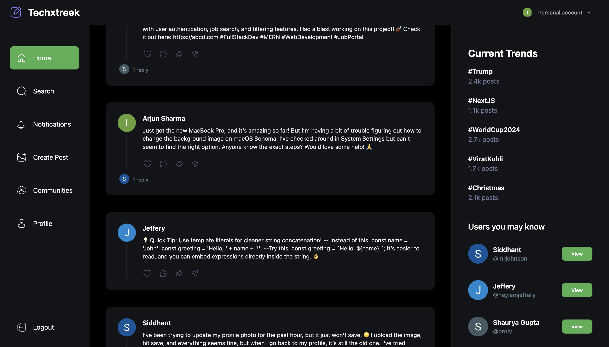

# Techxtreek

### Fully Functional Micro Blogging Site
- Full Stack
- Live Hosted
- Seamless UI/UX

## Tech Stack

### Front End
-  Next.js
-  React.js
-  Tailwind CSS

### Backend and Database
-  Node.js
-  MongoDB

## Screenshot
